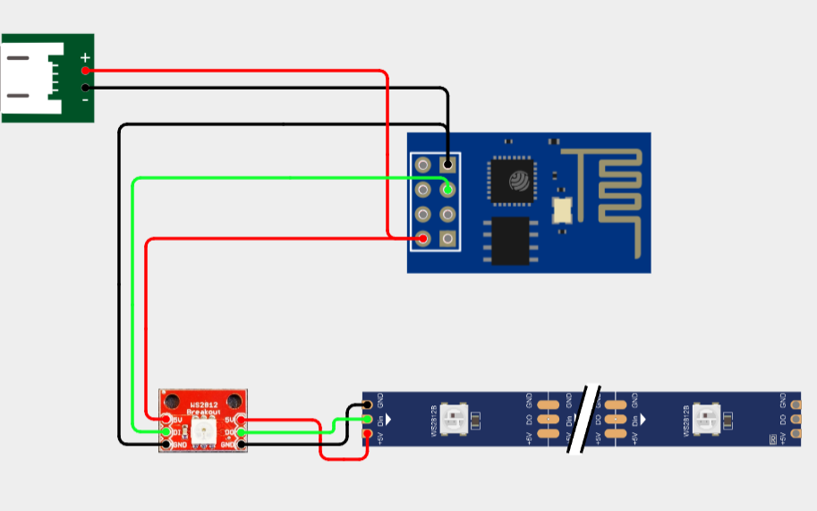
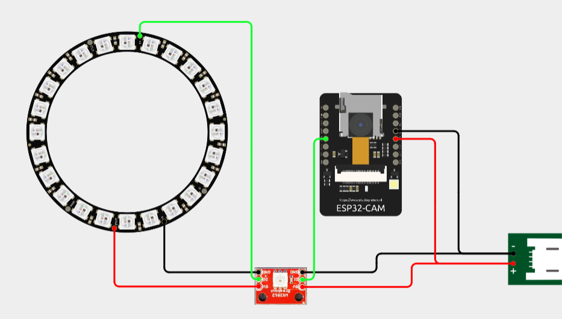

# Hardware Modules Documentation

This guide covers the setup and programming of the ESP-based hardware modules used in ElectroStore.

## LedStorage Module

### Required Materials

| Quantity | Component |
|----------|-----------|
| 1 | ESP-01 (ESP8266) or ESP32 |
| X | WS2812B LED strip |
| 1 | WS2812 LED controller for ESP01 |
| 1 | Micro-USB connector |
| 1 | 3D printed case |
| 1 | 3D printed LED mounting support |

### Wiring Diagram



### 3D Printing

The 3D files are located in the `ledstore/3d/` folder. Print the case and LED mounting supports to securely install the module on your storage units.

Compatible with Parkside drawer cabinets from Lidl:  
https://www.lidl.fr/p/parkside-casiers-a-tiroirs/p100377898

### Initial Setup with PlatformIO

#### Prerequisites

1. Install [VS Code](https://code.visualstudio.com/)
2. Install the [PlatformIO IDE extension](https://platformio.org/install/ide?install=vscode)
3. Clone or download the ElectroStore repository

#### First USB Upload

1. Open VS Code and navigate to the project folder:
   ```
   ledstore/ledstore_esp_arduino/
   ```

2. Open the PlatformIO sidebar (click the alien icon on the left)

3. Connect your ESP module to your computer via USB

4. Edit `platformio.ini` and update the `upload_port` in the `[env]` section:
   ```ini
   [env]
   upload_speed = 115200
   upload_port = COM6  ; Windows: COMx, Linux/macOS: /dev/ttyUSBx
   ```

5. Select the correct environment:
   - For ESP8266: `env:esp8266`
   - For ESP32: `env:esp32`

6. Click on "Upload" in the PlatformIO sidebar under your selected environment

7. Wait for the upload to complete. The ESP will restart automatically.

#### First Configuration

1. After the first upload, the ESP will create its own WiFi network:
   - **SSID**: `ESP_Config`
   - **Password**: `ConfigPass`

2. Connect to this network with your computer or smartphone

3. Open a web browser and navigate to: `http://192.168.4.1`

4. Configure the following settings:
   - **WiFi Settings**: Enter your WiFi SSID and password
   - **MQTT Settings**: Enter your MQTT broker address, port, username, and password
   - **User Settings**: Set a password to protect access to configuration pages
   - **OTA Settings**: Enable OTA (Over-The-Air) updates for future firmware updates

5. Save the configuration. The ESP will restart and connect to your WiFi network.

#### OTA Updates with PlatformIO

After enabling OTA in the web interface, you can update the firmware wirelessly without USB connection.

1. Find your ESP's IP address (check your router's DHCP table or the web interface)

2. Create an OTA environment in `platformio.ini`:
   ```ini
   ; ─── ESP8266 OTA ──────────────────────────────────────────────────────────
   [env:esp8266_ota]
   extends = env:esp8266
   upload_protocol = espota
   upload_port = 192.168.1.100  ; Replace with your ESP's IP address
   upload_flags =
       --port=8100
       --auth=your_password  ; Password configured in User Settings, or "0" if none
   ```

   Or for ESP32:
   ```ini
   ; ─── ESP32 OTA ────────────────────────────────────────────────────────────
   [env:esp32_ota]
   extends = env:esp32
   upload_protocol = espota
   upload_port = 192.168.1.100  ; Replace with your ESP's IP address
   upload_flags =
       --port=8100
       --auth=your_password  ; Password configured in User Settings, or "0" if none
   ```

3. In PlatformIO sidebar, select the OTA environment (`esp8266_ota` or `esp32_ota`)

4. Click "Upload" to flash the firmware over WiFi

**Note**: The ESP must be powered on and connected to the same network as your computer for OTA updates to work.

### Status LED

The first LED on the WS2812B strip indicates the module status:

| Color | Status |
|-------|--------|
| White | Initialization |
| Cyan | WiFi connected successfully |
| Red | WiFi connection failed |
| Green | MQTT connected successfully |
| Purple | MQTT connection failed |

---

## ScanBox Module

### Required Materials

| Quantity | Component |
|----------|-----------|
| 1 | ESP32-CAM |
| 1 | WS2812B LED |
| 1 | WS2812B Ring LED |
| 1 | ON/OFF switch |
| 1 | Micro-USB connector |
| 1 | 3D printed case |

### Wiring Diagram



### 3D Printing

The 3D files are located in the `scanbox/3d/` folder. Print preferably in white for better object detection and lighting.

### Initial Setup with PlatformIO

#### Prerequisites

1. Install [VS Code](https://code.visualstudio.com/)
2. Install the [PlatformIO IDE extension](https://platformio.org/install/ide?install=vscode)
3. Clone or download the ElectroStore repository

#### First USB Upload

1. Open VS Code and navigate to the project folder:
   ```
   scanbox/scanbox_esp_arduino/
   ```

2. Open the PlatformIO sidebar (click the alien icon on the left)

3. Connect your ESP32-CAM to your computer via USB (you may need an FTDI adapter or USB-to-Serial programmer)

4. Edit `platformio.ini` and update the `upload_port` in the `[env]` section:
   ```ini
   [env]
   upload_speed = 115200
   upload_port = COM6  ; Windows: COMx, Linux/macOS: /dev/ttyUSBx
   ```

5. For ESP32-CAM initial upload, you may need to:
   - Put the board in programming mode (connect GPIO0 to GND before powering on)
   - Press the RESET button after starting the upload

6. Click on "Upload" in the PlatformIO sidebar under `env:esp32`

7. Wait for the upload to complete. Remove the GPIO0-to-GND connection and press RESET.

#### First Configuration

1. After the first upload, the ESP32 will create its own WiFi network:
   - **SSID**: `ESP_Config`
   - **Password**: `ConfigPass`

2. Connect to this network with your computer or smartphone

3. Open a web browser and navigate to: `http://192.168.4.1`

4. Configure the following settings:
   - **WiFi Settings**: Enter your WiFi SSID and password
   - **MQTT Settings**: Enter your MQTT broker address, port, username, and password
   - **Camera Settings**: Configure camera resolution and quality
   - **User Settings**: Set a password to protect access to configuration pages
   - **OTA Settings**: Enable OTA (Over-The-Air) updates for future firmware updates

5. Save the configuration. The ESP32 will restart and connect to your WiFi network.

#### OTA Updates with PlatformIO

After enabling OTA in the web interface, you can update the firmware wirelessly.

1. Find your ESP32's IP address (check your router's DHCP table or the web interface)

2. Create an OTA environment in `platformio.ini`:
   ```ini
   ; ─── ESP32 OTA ────────────────────────────────────────────────────────────
   [env:esp32_ota]
   extends = env:esp32
   upload_protocol = espota
   upload_port = 192.168.1.101  ; Replace with your ESP32's IP address
   upload_flags =
       --port=8100
       --auth=your_password  ; Password configured in User Settings, or "0" if none
   ```

3. In PlatformIO sidebar, select the `esp32_ota` environment

4. Click "Upload" to flash the firmware over WiFi

**Note**: OTA updates are more reliable on ESP32 when the module is powered via a stable power supply (not just USB).

### Status LED

The first LED on the WS2812B strip indicates the module status:

| Color | Status |
|-------|--------|
| White | Initialization |
| Cyan | WiFi connected successfully |
| Red | WiFi connection failed |
| Blue | Image capture in progress |
| Green | Image sent to server successfully |

---

## Troubleshooting

### Upload fails with "espcomm_sync failed"

- Check that the correct COM port is selected
- For ESP32-CAM, ensure GPIO0 is connected to GND during upload
- Try reducing upload speed to 115200 or 9600

### OTA update fails

- Verify the ESP is connected to WiFi (check status LED)
- Ensure the IP address in `upload_port` is correct
- Check that the password in `upload_flags --auth` matches the configured password
- Make sure your computer and ESP are on the same network

### ESP creates its own WiFi network after configuration

- WiFi credentials may be incorrect
- Check WiFi signal strength at the ESP location
- Verify the WiFi network is 2.4GHz (ESP modules don't support 5GHz)

### Status LED shows purple (MQTT connection failed)

- Verify MQTT broker is running and accessible
- Check MQTT credentials (username/password)
- Ensure MQTT port is correct (default: 1883)
- Check firewall rules allow MQTT connections