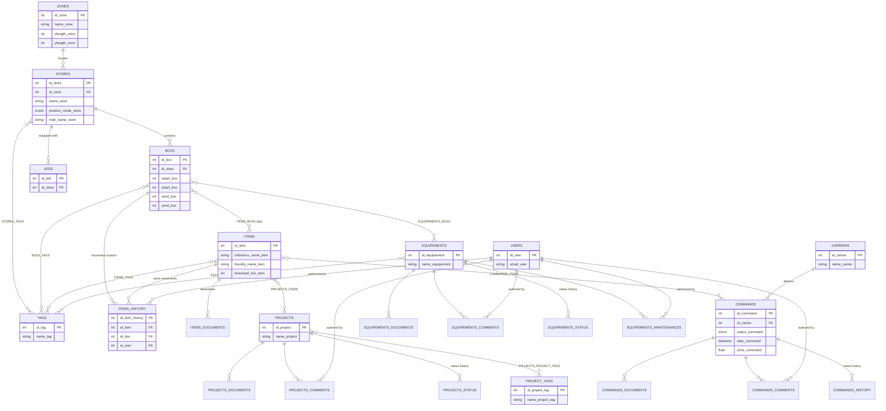

# Data model (MCD)

Conceptual data model of the ElectroStore domain, derived from `electrostoreAPI/Models/`. It is meant to be **kept in sync manually** whenever an entity or relation changes there — this file is not generated.

Written in [Mermaid](https://mermaid.js.org/syntax/entityRelationshipDiagram.html) `erDiagram` syntax so it renders directly on GitHub/GitLab and stays diffable in git. Edit it in any text editor, or use the [Mermaid Live Editor](https://mermaid.live/) for a visual preview.

Technical tables (authentication tokens, push subscriptions, scheduled jobs) are intentionally left out of the diagram below to keep it focused on the business domain — see [Technical tables](#technical-tables-not-shown-above) at the bottom.

## Diagram

## Reading notes

- `ITEMS_BOXS`, `BOXS_TAGS`, `STORES_TAGS`, `ITEMS_TAGS`, `EQUIPEMENTS_TAGS`, `EQUIPEMENTS_BOXS`, `PROJECTS_ITEMS`, `PROJECTS_PROJECT_TAGS`, `COMMANDS_ITEMS` are many-to-many junction tables (shown as `}o--o{` labels above); they are not detailed as separate entity blocks to keep the diagram readable — see the matching `*.cs` file in `electrostoreAPI/Models/` for their exact columns.
- `ITEMS_DOCUMENTS`, `EQUIPEMENTS_DOCUMENTS`, `PROJECTS_DOCUMENTS`, `COMMANDS_DOCUMENTS`, `EQUIPEMENTS_COMMENTS`, `PROJECTS_COMMENTS`, `COMMANDS_COMMENTS`, `EQUIPEMENTS_STATUS`, `EQUIPEMENTS_MAINTENANCES`, `COMMANDS_HISTORY`, `PROJECTS_STATUS` follow the same "one parent entity → many child rows" pattern and are omitted from the diagram body for the same reason.
- Every table inherits `created_at` / `updated_at` from `BaseEntity` (`electrostoreAPI/Models/BaseEntity.cs`) — not repeated per entity above.
- `Zones` ↔ `Stores` is optional (a store doesn't require a zone): `id_zone` is nullable.

## Technical tables (not shown above)

Infrastructure/auth concerns, unrelated to the inventory domain:

| Table | Purpose |
|---|---|
| `JwiAccessTokens` / `JwiRefreshTokens` | JWT session tokens, linked to `Users` |
| `UserPushSubscriptions` | Web push subscription endpoints, linked to `Users` |
| `CronJobs` | Scheduled task registry consumed by `electrostoreCRON` |

## Object storage (S3)

File data (item/equipement/zone pictures + thumbnails, datasheets, order documents) doesn't live in the relational database — only its path does (`url_picture_item`, `url_thumbnail_item`, etc.). Storage is handled by `electrostoreAPI`'s `FileService` (`electrostoreAPI/Services/FileService/FileService.cs`), with two interchangeable backends selected by config:

- **Local disk** (default): files under `electrostoreAPI/wwwroot/`.
- **S3-compatible** (MinIO client, works with the bundled [Garage](https://garagehq.deuxfleurs.fr/) or an external S3): a **single bucket** (`S3:BucketName`, default `electrostore-api`), with data organized by *prefix* — there is no per-domain bucket, so "role" here means prefix, not bucket.

| Prefix | Role |
|---|---|
| `itemImages/<id_item>/` | Item pictures |
| `itemImagesThumbnails/<id_item>/` | Item picture thumbnails |
| `itemDocuments/<id_item>/` | Item datasheets/documents |
| `equipementImages/<id_equipement>/` | Equipement pictures |
| `equipementImagesThumbnails/<id_equipement>/` | Equipement picture thumbnails |
| `equipementDocuments/<id_equipement>/` | Equipement documents |
| `zoneImages/<id_zone>/` | Zone pictures |
| `zoneImagesThumbnails/<id_zone>/` | Zone picture thumbnails |
| `projectDocuments/<id_project>/` | Project documents |
| `commandDocuments/<id_command>/` | Command (order) documents |

Each prefix is created/deleted alongside its owning entity (`CreateDirectory`/`DeleteDirectory` calls in the corresponding `*Service.cs`); on local disk this is a real folder, on S3 it's a no-op (S3 has no directories) and cleanup on delete lists+removes all keys under the prefix instead.

## Maintaining this document

When adding/renaming/removing an entity or a foreign key in `electrostoreAPI/Models/`, update the diagram above in the same PR. This is a manual step — there is currently no generator wired to keep it automatically in sync with EF Core migrations.

**Any change to a bucket/prefix name, a Kafka topic, or another generated config parameter must also be reflected in `docs/generator/`** (`js/config.js` collects the value from the form, `js/generators.js` emits it into `docker-compose.yml`, `appsettings.json`, and the `setup.sh`/`setup.ps1` init scripts) — otherwise the generator produces a working deployment that no longer matches what the code actually expects. See [CONTRIBUTING.md](../../CONTRIBUTING.md#keeping-the-generator-in-sync).
